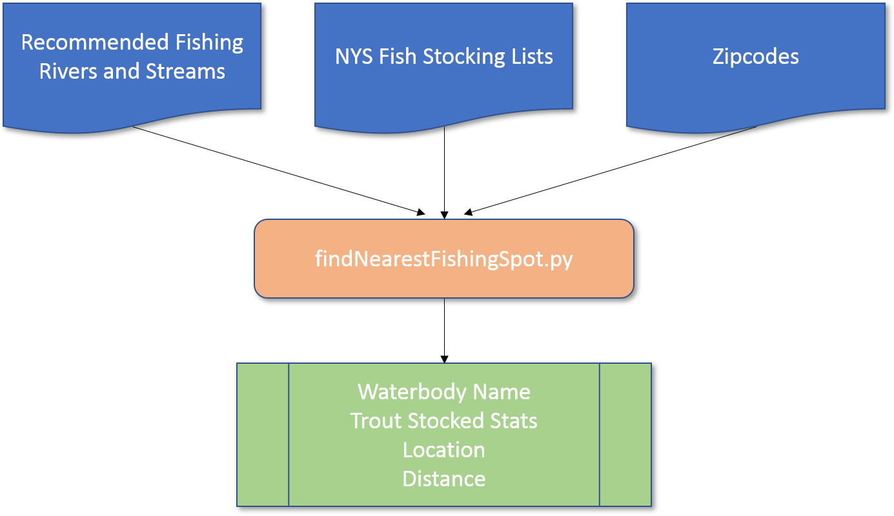
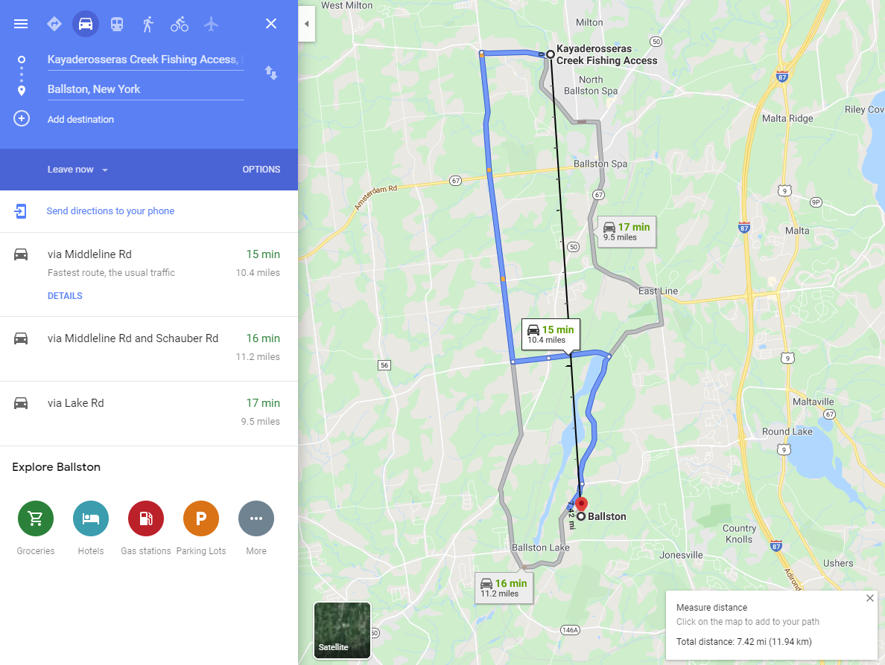

# NYS Trout Fishing Navigator:<br>

Each year DEC releases approximately 900,000 pounds of fish into more than 1,200 public streams, rivers, lakes and ponds across the state. When someone is planning a trip for trout fishing, it would be really helpful to know the exact location to go by inputting a zipcode.<br>

The idea is to combine the number of stocking trout in different area and the access locations of rivers and streams for fishing in New York State, then find the nearest location to the input zipcode. This location should be accessed by public and have stocking trout, which gives the fisherman less chance to get skunked.<br>

Data Sources:<br>
1. Recommended Fishing Rivers And Streams - I got my data from https://data.ny.gov/Recreation/Recommended-Fishing-Rivers-And-Streams/jcxg-7gnm<br>
2. Fish Stocking Lists (Actual): Beginning 2011 - I got my data from https://data.ny.gov/Recreation/Fish-Stocking-Lists-Actual-Beginning-2011/e52k-ymww<br>
3. Zipcodes - This dataset is the most recent one I found: https://www.aggdata.com/free/united-states-zip-codes<br>



Process:<br>

Required Python Packages<br>
```python
import pandas as pd
from math import cos, asin, sqrt
```
I mainly use pandas to clean and filter our data sources. The math package is used for the actual calculation. <br>

Step 1: Clean Data Sources<br>
For data cleaning, I used pandas to do the following:<br>

Create three dataframes, one for each data source<br>
Remove unnecessary columns<br>
Only include trout in stocked fish dataframe, group the total amount of each waterbody, assigned the calculated result to another dataframe<br>
```python
# -------------------------------------------------------
# ---------------- Inputs: Dataframes -------------------
# -------------------------------------------------------

df_fishing_spots = pd.read_csv(FILE_FISHING_SPOTS,encoding = "ISO-8859-1")
columns_to_drop = ['Special Regulations on Waterbody', 'Waterbody Information', 'Location']
df_fishing_spots.drop(columns_to_drop, axis=1, inplace=True)

df_fishstock = pd.read_csv(FILE_FISH_STOCK,encoding = "ISO-8859-1")
# filter only trout
df_fishstock = df_fishstock[df_fishstock['Species'].str.contains('Trout', na=False)]

# calculate the total number of trout stocked in each waterbody since 2011
df_group_fishstock = df_fishstock.groupby(['Waterbody'])['Number'].sum().reset_index()

df_zipcodes = pd.read_csv(FILE_ZIPCODES,encoding = "ISO-8859-1")
# filter only NY
df_zipcodes = df_zipcodes[df_zipcodes['State Abbreviation']=='NY']
```

I also created functions to retrieve data that I will need later:<br>
```python
def getRecord(zipcode):
    df = df_zipcodes.loc[df_zipcodes['Zip Code']==int(zipcode)]
    return df

def getFishingSpots(specy):
    df = df_fishing_spots[df_fishing_spots['Fish Species Present at Waterbody'].str.contains(specy)]
    return df.to_dict('records')
```

Step 2: Calculate the nearest fishing spot by Zipcode<br>
The Haversine (https://stackoverflow.com/questions/41336756/find-the-closest-latitude-and-longitude) formula is one way of calculating the distance between two points: the latitude-longtitude of the zipcode and fishing spot.<br>
```python
def distance(lat1, lon1, lat2, lon2):
    p = 0.017453292519943295  #Pi/180
    a = 0.5 - cos((lat2-lat1)*p)/2 + cos(lat1*p)*cos(lat2*p) * (1-cos((lon2-lon1)*p)) / 2
    return 12742 * asin(sqrt(a)) #2*R*asin..
```

For the input zipcode, the script will calculate its distance to all recommented fishing spots in the NYS. To get the nearest fishing spot with stocked trout, here's the method:<br>
```python
def closest(data, zipcode):
    dl = []
    for p in data:
        ap = {
        'zipcode': zipcode['Zip Code'],
        'country': zipcode['Country'],
        'state': zipcode['State Abbreviation'],
        'state_full': zipcode['State'],
        'county': zipcode['County'],
        'latitude-zip': zipcode['Latitude'],
        'longitude-zip': zipcode['Longitude'],
        'nearest-fishspot': p['Waterbody Name'],
        'latitude-fish': p['Latitude'],
        'longitude-fish': p['Longitude'],
        'distance': distance(zipcode['Latitude'],zipcode['Longitude'],p['Latitude'],p['Longitude'])
        }
        dl.append(ap)
    dl_sorted = sorted(dl, key=lambda k: k['distance'])
    
    # Only return the waterbody that DEC released the stocking trout in
    for i in range(0,len(dl_sorted)):
        if dl_sorted[i]['nearest-fishspot'] in df_group_fishstock['Waterbody'].values:
            dl_sorted[i].setdefault('trout_stocked', df_group_fishstock['Number'].loc[df_group_fishstock['Waterbody']
            == dl_sorted[i]['nearest-fishspot']])
            break

    return dl_sorted[i]
```
The closest method returns the calculation with the shortest distance of the spot that has stocking fish (return dl_sorted[i]) <br>

Step 3: Take the valid input, print out the result.<br>
Only take the valid zipcode (existing place in New York state), print out the final result:<br>
Waterbody name, the number of trout that have ever been released in this spot, the latitude-longtitude of the spot and the distance.<br>
```python
print('**********************************************************')
print('*               Trout fishing navigator                  *')
print('**********************************************************')

zc = ''
data_exist = False

while not zc.isdigit() or not data_exist:
    print('Input zipcode where you are plan to go: \n')
    zc = input()

    if zc.isdigit():
        if (df_zipcodes['Zip Code'] == int(zc)).any():
            data_exist = True
        else:
            print('%s is invalid zipcode!' % zc)
    
record = getRecord(zc)

fishingSpot = closest(getFishingSpots('Trout'), record)
print('Waterbody Name: ' + fishingSpot['nearest-fishspot'])
print('Trout stocked: %8d' % int(fishingSpot['trout_stocked']))
print('Location: %2.9f %2.9f' % (fishingSpot['latitude-fish'], fishingSpot['longitude-fish'])) 
print('Distance: %8.2f miles' % (fishingSpot['distance']*0.621371)) # converted from km to mile
```

Example:<br>
Now, let's find a fishing spot to zipcode 12019.<br>
```python
**********************************************************
*               Trout fishing navigator                  *
**********************************************************
Input zipcode where you are plan to go: 

12019
Waterbody Name: Kayaderosseras Creek
Trout stocked:    77960
Location: 43.026143257 -73.864757704
Distance:     7.40 miles
```
Based on the script, the nearest fishing spot to 12019 is: Kayaderosseras Creek, it's 7.40 miles from 12019.<br>

Let's validate the model by plotting in Google Maps:<br>
<br>
The black line indicates the distance of 7.42 mile from 12019 to the fishing spot, which is close to 7.40 mile!<br>
Note that the formula doesn't consider the actual roads in the location. Haversine simply calculates the distance from point A to point B.<br>


